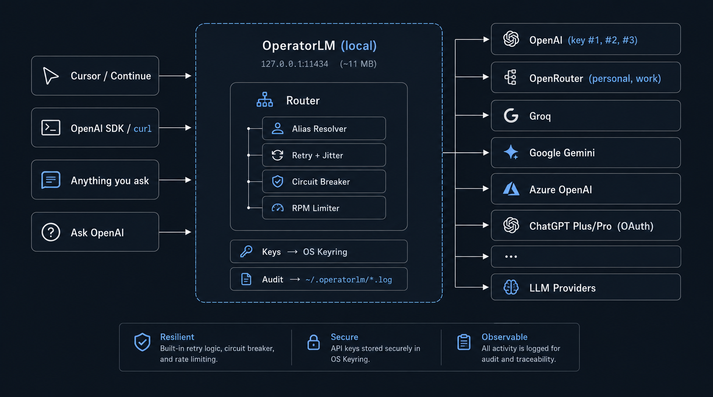

# OperatorLM

[English](README.md) | [Español](README.es.md) | [Português](README.pt.md) | [简体中文](README.zh.md)

[](https://opensource.org/licenses/MIT)
[](https://go.dev/)
[](#build-from-source)
[](#)
[](#)
[](#configuración--secretos)

> **Un proxy local, compatible con OpenAI, con failover real, aliasing multi-cuenta y cero secretos en disco.**
> Un único binario se sitúa entre tu IDE/SDK y cada proveedor LLM que uses — OpenAI, OpenRouter, Groq, Google Gemini, Azure OpenAI, e incluso tu suscripción a **ChatGPT Plus/Pro**.


> [!IMPORTANT]
> OperatorLM escucha en `127.0.0.1:11434` por defecto — el mismo puerto que Ollama. Cualquier herramienta que ya apunte a Ollama funciona sin tocar nada. Si corres ambos, cambia uno en `~/.operatorlm/config.toml`.

## Quick Start

**¿Solo quieres ejecutarlo?** Descarga el último binario — sin Go toolchain, sin Docker.

### 1. Descargar

Ve a la [página de Releases](https://github.com/aralde/operatorlm/releases/latest) y descarga el asset para tu sistema operativo:

| OS                    | Asset                              |
| --------------------- | ---------------------------------- |
| Windows (x64)         | `OperatorLM-windows-amd64.exe`     |
| macOS (Apple silicon) | `OperatorLM-darwin-arm64`          |
| macOS (Intel)         | `OperatorLM-darwin-amd64`          |
| Linux (x64)           | `OperatorLM-linux-amd64`           |

> [!NOTE]
> En macOS/Linux, dale permiso de ejecución: `chmod +x OperatorLM-*`.

### 2. Ejecutar

- **Windows**: doble clic en `OperatorLM-windows-amd64.exe`. Aparece un icono en la bandeja (sin ventana de consola). En la primera ejecución, SmartScreen puede mostrar *"Windows protegió tu PC"* → haz clic en **Más información → Ejecutar de todas formas** (el binario no está firmado).
- **macOS desktop**: `./OperatorLM-darwin-*` — aparece el icono en la bandeja. La primera vez, Gatekeeper lo bloqueará → clic derecho sobre el binario en Finder → **Abrir** → **Abrir** otra vez en el diálogo (solo es necesario una vez).
- **Linux desktop**: `./OperatorLM-linux-amd64` — aparece el icono en la bandeja.
- **Linux headless**: `OPERATORLM_NO_TRAY=1 ./OperatorLM-linux-amd64`.

### 3. Abrir el admin UI

Entra a **<http://127.0.0.1:11434/admin/>** → agrega un provider → pega una API key → manda un request de prueba desde la pestaña **Try It**.

### 4. Apunta tus herramientas al proxy

Cualquier cliente compatible con OpenAI funciona — pon como base URL `http://127.0.0.1:11434/v1` y cualquier `api_key` no vacía (OperatorLM inyecta la real). Tienes ejemplos listos para copiar-pegar en `curl` / Python / JavaScript en [Úsalo desde cualquier cosa que hable OpenAI](#4-úsalo-desde-cualquier-cosa-que-hable-openai) más abajo.

> ¿Prefieres compilar desde el source? Ve a [Build from source](#build-from-source).

---

## Demo


## Tabla de contenidos

- [Quick Start](#quick-start)
- [¿Por qué este proyecto?](#por-qué-este-proyecto)
- [Casos de uso](#casos-de-uso)
- [Cómo funciona](#cómo-funciona)
- [La feature estrella: aliases multi-cuenta](#-la-feature-estrella-aliases-multi-cuenta)
- [Failover que de verdad hace failover](#%EF%B8%8F-failover-que-de-verdad-hace-failover)
- [ChatGPT Plus/Pro como backend (experimental)](#-chatgpt-pluspro-como-backend-experimental)
- [Cómo se compara OperatorLM](#cómo-se-compara-operatorlm)
- [Build from source](#build-from-source)
- [Endpoints soportados](#endpoints-soportados)
- [Providers soportados](#providers-soportados)
- [Configuración & secretos](#configuración--secretos)
- [Modelo de seguridad](#modelo-de-seguridad)
- [Estructura del repositorio](#estructura-del-repositorio)
- [Estado y contribución](#estado-y-contribución)

## ¿Por qué este proyecto?

- 🔀 **Aliasing multi-cuenta** — apila 3 API keys de OpenAI, 2 cuentas de OpenRouter, y un Groq gratuito como backup detrás de un único nombre de modelo. OperatorLM recorre la lista hasta que una funciona.
- 🛡️ **Failover de nivel productivo** — **circuit breaker** por target (3 estados), retries con exponential backoff + jitter, **RPM limiter** con sliding window. Cooldowns distintos para 429 / 5xx / errores de red.
- 🔐 **Cero secretos en disco** — Las API keys viven en **Windows Credential Manager / macOS Keychain / Linux Secret Service**. El archivo TOML solo guarda *referencias*, nunca las keys.
- 🖥️ **Admin UI embebida en vivo** — Gestiona providers, keys, aliases, ajustes de reliability, y mira el audit log en streaming — todo desde `http://127.0.0.1:11434/admin/`. Cero instalación: está embebida con `go:embed` en el binario.
- 🧪 **Audit log en JSONL** — Cada request: modelo, intento, URL upstream, status, duración. Los headers `Authorization` se redactan por defecto. Writer no bloqueante.
- 🤖 **ChatGPT Plus/Pro como backend** — Logueas una vez vía OAuth (PKCE), y tu cuota de Plus/Pro queda enchufada en la misma API compatible con OpenAI que ya hablan tus herramientas. *(Experimental — lee el disclaimer abajo.)*
- 🪶 **Un binario de ~11 MB, ~50 MB de RAM en idle** — Go nativo. Sin `node_modules`, sin Python, sin Docker. Arranca en milisegundos.
- 🛰️ **Modo headless** — `OPERATORLM_NO_TRAY=1` para correrlo en una caja Linux sin sesión de escritorio.
- 🪟 **Sin flash de consola en Windows** — compilado con `-H=windowsgui`. Es una tray app de verdad.

---

## Casos de uso

- **Estirar tiers gratis / baratos** — encadena Groq → OpenRouter → OpenAI detrás de un único alias. El día a día pega al free tier, y solo se desborda al de pago cuando el gratuito se rate-limitea.
- **Múltiples cuentas personales/de trabajo bajo un solo nombre de modelo** — mantén las keys `openai_personal`, `openai_work` y `openai_side` separadas en el OS keyring, expónlas a Cursor/Continue como un único modelo `gpt-4o`, y deja que el router las recorra ante un 429.
- **ChatGPT Plus/Pro en vez de créditos de API** — loguea una vez vía OAuth y enruta tus llamadas a modelos Codex / GPT-5.x a través de tu cuota Plus/Pro existente, sin facturación de API *(experimental — lee el [disclaimer](#-chatgpt-pluspro-como-backend-experimental))*.
- **Reemplazo drop-in de Ollama** — OperatorLM se ata a `127.0.0.1:11434`, así que cualquier herramienta que ya apunte a Ollama (Continue, Cline, Open WebUI, Zed, …) sigue funcionando sin cambios pero ahora alcanza OpenAI / OpenRouter / Gemini / Azure / Bedrock / etc.
- **Tráfico LLM auditable en una máquina de dev o una estación compartida** — cada request cae en JSONL redactado, las keys viven en el OS keyring (nunca en disco), y la admin UI es solo loopback con validación de host-header y una API key local opcional.
- **Gateway self-hosted en modo headless** — corre en una VM Linux / NAS / home server con `OPERATORLM_NO_TRAY=1`, alcanza `127.0.0.1:11434` por WireGuard o Tailscale desde tu laptop, y centraliza tus keys y audit log en un solo lugar.

---

## Cómo funciona



1. **Recibe** un request en formato OpenAI en `127.0.0.1:11434`.
2. **Resuelve** el campo `model` → o por match de prefijo (`openai/gpt-4o`, `groq/llama-3.3-70b-versatile`) o por un **alias** definido por el usuario que se reparte entre varias cuentas/providers.
3. **Inyecta** la API key correcta desde el OS keyring por cada intento.
4. **Intenta, reintenta y rompe** — exponential backoff entre intentos; abre el circuit breaker del target ante fallos repetidos; respeta `Retry-After`.
5. **Audita** cada intento en un log JSONL redactado.

---

## ✨ La feature estrella: aliases multi-cuenta

La mayoría de proxies locales enrutan un nombre de modelo a un único upstream. OperatorLM deja que un nombre de modelo se reparta a **N upstreams en orden de prioridad**, con rate limits por target y failover automático.

### Ejemplo: tres cuentas de OpenAI detrás de un único nombre de modelo

```toml
# ~/.operatorlm/config.toml

[[providers]]
name        = "openai"
type        = "openai"
base_url    = "https://api.openai.com/v1"
prefix      = "openai/"
api_key_ref = "operatorlm:openai_personal"   # key por defecto

  [[providers.keys]]
  name        = "work"
  api_key_ref = "operatorlm:openai_work"

  [[providers.keys]]
  name        = "side-project"
  api_key_ref = "operatorlm:openai_side"

[[aliases]]
name     = "gpt-4o"
strategy = "order"

  [[aliases.targets]]
  provider       = "openai"
  key            = "default"          # la key personal primero
  upstream_model = "gpt-4o"
  order          = 1
  rpm            = 60

  [[aliases.targets]]
  provider       = "openai"
  key            = "work"             # cae a la key del trabajo ante fallo / 429
  upstream_model = "gpt-4o"
  order          = 2
  rpm            = 60

  [[aliases.targets]]
  provider       = "openai"
  key            = "side-project"     # último recurso
  upstream_model = "gpt-4o"
  order          = 3
```

Ahora tu IDE solo dice `model: "gpt-4o"` y OperatorLM recorre las keys hasta que una sirve. ¿Te chocas con un 429 en la key #1? El circuit breaker la abre por 15 s y la key #2 toma el relevo de inmediato.

### Ejemplo: failover cross-provider (optimización de costos)

```toml
[[aliases]]
name     = "fast-llama"
strategy = "order"

  [[aliases.targets]]
  provider       = "groq"             # gratis + más rápido, prueba primero
  upstream_model = "llama-3.3-70b-versatile"
  order          = 1
  rpm            = 30                  # respeta el RPM del free tier de Groq

  [[aliases.targets]]
  provider       = "openrouter"       # fallback de pago si Groq está rate-limited
  upstream_model = "meta-llama/llama-3.3-70b-instruct"
  order          = 2
```

Mandas `model: "fast-llama"` — obtienes Groq cuando está disponible, OpenRouter cuando no. **Cero cambios del lado del cliente.**

---

## 🛡️ Failover que de verdad hace failover

| Mecanismo            | Qué hace                                                                                       | Default              |
| -------------------- | ---------------------------------------------------------------------------------------------- | -------------------- |
| Retry + jitter       | Retries por target con exponential backoff, full jitter, respeta `Retry-After`                 | 2 retries, 500 ms base, 10 s cap |
| Circuit breaker      | Abre por target tras N fallos consecutivos; closed → open → half-open                          | 3 fallos             |
| Cooldown 429         | Cooldown cuando el upstream rate-limitea                                                       | 15 s                 |
| Cooldown 5xx         | Cooldown ante errores de servidor upstream                                                     | 60 s                 |
| Cooldown de red      | Cooldown ante fallos de DNS / TCP / timeout                                                    | 90 s                 |
| RPM limiter          | Sliding window de 60 segundos por target — skip en vez de bloquear                             | configurable por target |
| Timeout por intento  | Cap duro por llamada upstream                                                                  | 60 s (180 s total)   |
| Stream idle timeout  | Aborta un stream SSE muerto                                                                    | 30 s                 |

Todo esto se afina en vivo desde la pestaña **Reliability** del admin UI — sin reiniciar.

---

## 🤖 ChatGPT Plus/Pro como backend (experimental)

<details>
<summary><strong>⚠️ Lee este disclaimer antes de habilitar el provider <code>chatgpt-codex</code></strong></summary>

> [!WARNING]
> El provider `chatgpt-codex` no es oficial y no está respaldado por OpenAI. Reusa el client ID público de OAuth del Codex CLI oficial de OpenAI (`app_EMoamEEZ73f0CkXaXp7hrann`).
>
> - OpenAI puede rotar o revocar ese ID en cualquier momento y romper este provider.
> - El uso puede violar los Términos de Servicio de OpenAI.
> - Solo se soporta `/v1/responses` (no chat/completions, no imágenes).
> - **Úsalo bajo tu propio riesgo.** Si quieres un camino soportado, usa el provider `openai` con tu propia API key.

</details>

Si aceptas el riesgo: abre la admin UI, agrega un provider `chatgpt-codex`, haz clic en **Login with ChatGPT** — se abre un navegador, inicias sesión, y los tokens se guardan en tu OS keyring con refresh automático. A partir de ahí, los modelos Codex / GPT-5.x quedan accesibles a través del mismo endpoint `/v1/responses` que cualquier otro provider.

---

## Cómo se compara OperatorLM

| Feature                                  | OperatorLM | LiteLLM proxy | OmniRoute |
| ---------------------------------------- | :--------: | :-----------: | :-------: |
| Binario único, sin runtime               | ✅         | ❌ (Python)    | ❌        |
| Multi-cuenta / rotación de keys por provider | ✅      | ✅             | ✅        |
| Circuit breaker + retry + RPM limiter    | ✅         | parcial        | parcial   |
| Keys en OS keyring (sin plaintext)       | ✅         | ❌             | ❌        |
| Admin UI embebida                        | ✅         | ✅             | ✅        |
| Tray app nativa                          | ✅         | ❌             | ❌        |
| Audit log (JSONL, redactado)             | ✅         | ✅             | ✅        |
| ChatGPT Plus/Pro como backend            | ✅ (exp.)  | ❌             | ❌        |

**Elige OperatorLM si** quieres un proxy desktop-first, de un único binario, que maneje failover y routing multi-cuenta como un servicio productivo — sin correr un servicio en Python ni mandar tus keys por la nube de alguien más.

---

## Build from source

### 1. Compilar

```powershell
# Windows
.\build.ps1
```

```bash
# Linux / macOS
./build.sh
```

> [!NOTE]
> Se requiere CGO (para el system tray + OS keyring).
> **Linux**: instala `gcc libgtk-3-dev libayatana-appindicator3-dev` (Debian/Ubuntu) o los equivalentes de Fedora/RHEL listados en `build.sh`.

### 2. Ejecutar

```bash
# Windows
.\OperatorLM.exe

# Linux / macOS (desktop)
./OperatorLM

# Linux (servidor headless, sin tray)
OPERATORLM_NO_TRAY=1 ./OperatorLM
```

Aparece un icono en la bandeja. La admin UI está en **<http://127.0.0.1:11434/admin/>**.

### 3. Configurar (admin UI)

1. Abre la admin UI.
2. **Providers** → agrega un provider, elige su tipo (`openai`, `openrouter`, `groq`, `gemini`, `azure-openai`, `chatgpt-codex`, `custom`).
3. **Keys** → pega tu API key. Se escribe en el OS keyring; el TOML solo guarda la referencia.
4. **Aliases** *(opcional)* → arma failover multi-cuenta / multi-provider.
5. **Try It** → dispara un request inline para verificar.

### 4. Úsalo desde cualquier cosa que hable OpenAI

```bash
curl http://127.0.0.1:11434/v1/chat/completions \
  -H "Content-Type: application/json" \
  -d '{"model":"groq/llama-3.3-70b-versatile","messages":[{"role":"user","content":"hi"}]}'
```

```python
from openai import OpenAI

client = OpenAI(
    base_url="http://127.0.0.1:11434/v1",
    api_key="not-needed",          # OperatorLM inyecta la key real
)
print(client.chat.completions.create(
    model="groq/llama-3.3-70b-versatile",
    messages=[{"role": "user", "content": "hi"}],
).choices[0].message.content)
```

```javascript
import OpenAI from "openai";

const openai = new OpenAI({
  baseURL: "http://127.0.0.1:11434/v1",
  apiKey: "not-needed",
});

const chat = await openai.chat.completions.create({
  model: "groq/llama-3.3-70b-versatile",
  messages: [{ role: "user", content: "hi" }],
});
console.log(chat.choices[0].message.content);
```

Apunta Cursor / Continue / cualquier cliente compatible con OpenAI a `http://127.0.0.1:11434/v1` y listo.

---

## Endpoints soportados

| Endpoint                       | Estado                                  |
| ------------------------------ | --------------------------------------- |
| `POST /v1/chat/completions`    | ✅ Completo, con streaming               |
| `POST /v1/images/generations`  | ✅ (sin streaming)                       |
| `POST /v1/responses`           | ✅ (usado por `chatgpt-codex`)           |
| `GET  /v1/models`              | ✅ Agregado de todos los providers configurados |

## Providers soportados

`openai` · `openrouter` · `groq` · `gemini` · `azure-openai` · `mistral` · `nvidia-nim` · `bedrock` · `opencode-zen` · `chatgpt-codex` · `custom` (cualquier upstream compatible con OpenAI).

---

## Configuración & secretos

### Ubicación de archivos

- **Config**: `~/.operatorlm/config.toml`
- **Logs**: `~/.operatorlm/operatorlm.log`
- **Audit Log**: `~/.operatorlm/audit.log` (JSONL, redactado)

### Dónde viven realmente tus API keys

| OS          | Backend                    | Dónde inspeccionar                                |
| ----------- | -------------------------- | ------------------------------------------------- |
| **Windows** | Credential Manager         | *Panel de control → Administrador de credenciales* |
| **macOS**   | Keychain                   | *App Acceso a Llaveros*                           |
| **Linux**   | Secret Service (D-Bus)     | `seahorse` (GNOME) o `kwalletmanager` (KDE)       |

El TOML referencia las keys por nombre (`operatorlm:openai_work`) — nunca el secreto en sí.

> [!NOTE]
> **Linux headless**: requiere un daemon de Secret Service corriendo (p. ej. `gnome-keyring-daemon --components=secrets`) y una sesión D-Bus válida.

---

## Modelo de seguridad

- **Solo loopback** — se ata a `127.0.0.1` por defecto.
- **Validación de host header** en la admin API (defensa contra DNS rebinding).
- **Header custom obligatorio** en endpoints admin mutantes (`X-OperatorLM-Admin`).
- **Sin CORS** por defecto.
- **Auth local opcional** — activa una API key local desde la admin UI para restringir acceso en máquinas compartidas.
- **Redacción en el audit** — `Authorization` y otros headers sensibles siempre se redactan antes de escribirse al audit log.

---

## Estructura del repositorio

```
internal/
  config/      # TOML + integración con OS keyring
  providers/   # openai · openrouter · groq · gemini · azure · chatgpt-codex · custom
  router/      # alias resolver · retry · circuit breaker · rate limiter
  server/      # handlers HTTP + admin UI embebida (web/)
  audit/       # audit logger JSONL no bloqueante
  tray/        # system tray multiplataforma
main.go        # entrypoint
```

El codebase es lo bastante chico como para auditarlo en una tarde. Esa es la idea.

---

## Estado y contribución

Proyecto personal, liberado tal cual — pero activamente usado y mantenido.

Si OperatorLM te ahorra tiempo o te facilita el setup, **una ⭐ en GitHub es el "gracias" más amable** y ayuda a que otros developers lo encuentren.

Bug reports, pull requests e integraciones de providers son muy bienvenidos.

**Licencia**: [MIT](LICENSE)
