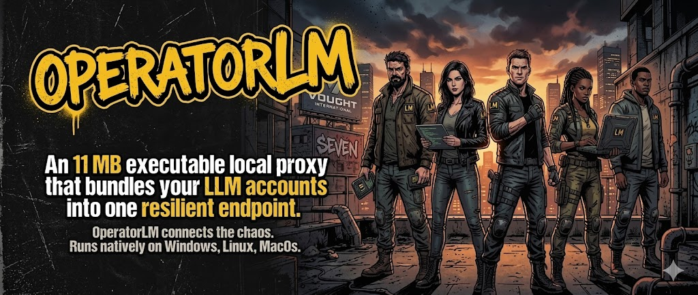
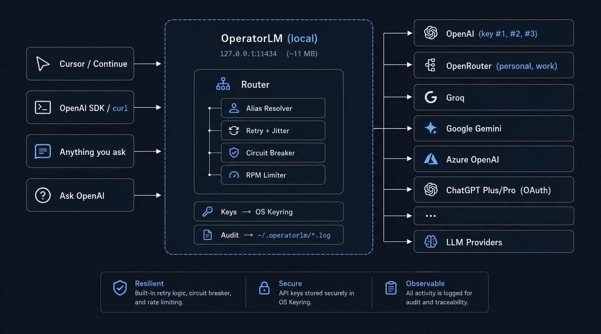

# OperatorLM

[English](README.md) | [Español](README.es.md) | [Português](README.pt.md) | [简体中文](README.zh.md)

[](https://opensource.org/licenses/MIT)
[](https://go.dev/)
[](#build-from-source)
[](#)
[](#)
[](#配置与密钥)

> **一个本地的、兼容 OpenAI 的 proxy，支持真正的 failover、多账号 aliasing，并且磁盘上零密钥。**
> 一个小巧的二进制文件坐在你的 IDE / SDK 和每一个 LLM provider 之间 —— OpenAI、OpenRouter、Groq、Google Gemini、Azure OpenAI、Anthropic，甚至你的 **ChatGPT Plus/Pro** 订阅。它还能运行**完全本地**的 GGUF 模型、embeddings 和语音(STT/TTS),完全不依赖云 —— 在同一个二进制里既是 Ollama 替代品,又是通往云端的 router。



> [!IMPORTANT]
> OperatorLM 默认监听 `127.0.0.1:11434` —— 和 Ollama 同一个端口。任何已经指向 Ollama 的工具都可以开箱即用。如果你两个都跑，在 `~/.operatorlm/config.toml` 里改其中一个的端口即可。

## Quick Start

**只想直接运行?** 下载最新的二进制文件 —— 不需要 Go toolchain，也不需要 Docker。

### 1. 下载

打开 [Releases 页面](https://github.com/aralde/operatorlm/releases/latest),根据你的操作系统下载对应的 asset:

| OS                    | Asset                              |
| --------------------- | ---------------------------------- |
| Windows (x64)         | `OperatorLM-windows-amd64.exe`     |
| macOS (Apple silicon) | `OperatorLM-darwin-arm64`          |
| macOS (Intel)         | `OperatorLM-darwin-amd64`          |
| Linux (x64)           | `OperatorLM-linux-amd64`           |

> [!NOTE]
> 在 macOS / Linux 上需要先给二进制加可执行权限: `chmod +x OperatorLM-*`。

### 2. 运行

- **Windows**: 双击 `OperatorLM-windows-amd64.exe`,任务栏出现托盘图标(没有控制台窗口)。首次启动时 SmartScreen 可能提示 *"Windows 已保护你的电脑"*,点 **更多信息 → 仍要运行**(二进制未签名)。
- **macOS desktop**: `./OperatorLM-darwin-*` —— 任务栏出现托盘图标。首次启动会被 Gatekeeper 拦截,在 Finder 里右键二进制 → **打开** → 在弹窗里再点一次 **打开**(只需一次)。
- **Linux desktop**: `./OperatorLM-linux-amd64` —— 任务栏出现托盘图标。
- **Linux headless**: `OPERATORLM_NO_TRAY=1 ./OperatorLM-linux-amd64`。

### 3. 打开 admin UI

浏览器打开 **<http://127.0.0.1:11434/admin/>** → 添加一个 provider → 粘贴 API key → 在 **Try It** 标签页发一个测试请求。

### 4. 把你的工具指向它

任何兼容 OpenAI 的客户端都可用 —— 把 base URL 设为 `http://127.0.0.1:11434/v1`,`api_key` 填任意非空字符串即可(OperatorLM 会注入真正的 key)。`curl` / Python / JavaScript 的可复制粘贴示例见下面 [从任何会说 OpenAI 的工具中使用](#4-从任何会说-openai-的工具中使用)。

> 想从源码编译? 见 [Build from source](#build-from-source)。

---

## Demo


## 目录

- [Quick Start](#quick-start)
- [为什么有这个项目?](#为什么有这个项目)
- [典型场景](#典型场景)
- [工作原理](#工作原理)
- [杀手级特性:多账号 aliases](#-杀手级特性多账号-aliases)
- [真正能 failover 的 failover](#%EF%B8%8F-真正能-failover-的-failover)
- [在本地运行模型(chat、视觉、embeddings、语音)](#-在本地运行模型chat视觉embeddings语音)
- [兼容 Anthropic 的 API](#-兼容-anthropic-的-api)
- [ChatGPT Plus/Pro 作为后端(实验性)](#-chatgpt-pluspro-作为后端实验性)
- [保持更新](#-保持更新)
- [OperatorLM 横向对比](#operatorlm-横向对比)
- [Build from source](#build-from-source)
- [支持的 endpoints](#支持的-endpoints)
- [支持的 providers](#支持的-providers)
- [配置与密钥](#配置与密钥)
- [安全模型](#安全模型)
- [仓库结构](#仓库结构)
- [项目状态与贡献](#项目状态与贡献)

## 为什么有这个项目?

- 🔀 **多账号 aliasing** —— 把 3 个 OpenAI key、2 个 OpenRouter 账号和一个免费的 Groq 兜底,统一放在一个模型名背后。OperatorLM 会依次尝试,直到有一个成功为止。
- 🛡️ **生产级 failover** —— 每个 target 都有 **circuit breaker**(3 状态),retry 使用 exponential backoff + jitter,**RPM limiter** 使用 sliding window。对 429 / 5xx / 网络错误使用不同的 cooldown。
- 🔐 **磁盘上零密钥** —— API key 存放在 **Windows Credential Manager / macOS Keychain / Linux Secret Service** 中。TOML 文件里只放 *引用*,永远不放密钥本身。
- 🖥️ **内嵌的实时 admin UI** —— 在 `http://127.0.0.1:11434/admin/` 中管理 providers、keys、aliases、reliability 配置,并实时观察 audit log 流。零安装:通过 `go:embed` 内嵌在二进制中。
- 🧪 **JSONL 格式的 audit log** —— 记录每个请求:模型、attempt、upstream URL、status、耗时。`Authorization` 头默认脱敏。Writer 非阻塞。
- 🤖 **ChatGPT Plus/Pro 作为后端** —— 通过 OAuth (PKCE) 登录一次,你的 Plus/Pro 配额就接入了和你的工具已经在用的同一个 OpenAI 兼容 API。*(实验性 —— 见下面的免责声明。)*
- 🖥️ **在本地运行模型(内置 llama.cpp)** —— 把它指向一个装满 `*.gguf` 文件的目录,OperatorLM 会按需启动 `llama-server`,无需单独的守护进程。**目录(catalog)**支持一键下载精选的 chat、视觉和 embedding 模型。一个*同时*能路由到云端的 Ollama 替代品。
- 🧬 **本地 embeddings** —— `/v1/embeddings` 由本地 GGUF 模型(Qwen3-Embedding、EmbeddingGemma)在一个独立 sidecar 上提供 —— 非常适合离线 RAG / 语义搜索。云端 embeddings(OpenAI、Azure、Gemini)也走同一个 endpoint。
- 🎙️ **本地语音(STT + TTS)** —— 用 **Whisper** 转写(`/v1/audio/transcriptions`),用 **Piper** 合成(`/v1/audio/speech`),或**实时把聊天流式转成语音**(`/v1/audio/speech/realtime`)。语音目录支持一键下载。
- 🟣 **兼容 Anthropic** —— 原生 `/v1/messages` endpoint,外加一个在 OpenAI↔Anthropic 之间双向转换的 `anthropic` provider,因此讲 Claude API 的工具(比如 Claude Code)也能指向 OperatorLM。
- ⬆️ **OTA 自更新** —— 从托盘点 "Check for updates" 会下载匹配你 OS 的 release asset,校验其 SHA-256,原地替换二进制并重新执行。
- 🪶 **一个小巧的二进制,idle 时占用极低 RAM** —— 原生 Go。无 `node_modules`、无 Python、无 Docker。毫秒级启动。
- 🛰️ **Headless 模式** —— `OPERATORLM_NO_TRAY=1`,可以在没有桌面会话的 Linux 上运行。
- 🪟 **Windows 上无控制台闪窗** —— 编译时带 `-H=windowsgui`。它是一个真正的 tray app。

---

## 典型场景

- **把免费 / 低价 tier 用到极致** —— 把 Groq → OpenRouter → OpenAI 串成一个 alias。日常编码命中免费 tier,只有在免费 tier 被 rate-limited 时才溢出到付费档。
- **把多个个人 / 工作账号统一到一个模型名下** —— 在 OS keyring 里分别保存 `openai_personal`、`openai_work`、`openai_side`,对外暴露为一个 `gpt-4o` 模型给 Cursor / Continue 用,遇到 429 时让 router 自动轮换。
- **用 ChatGPT Plus/Pro 替代 API 额度** —— 通过 OAuth 登录一次,把 Codex / GPT-5.x 系列模型的调用走到你已有的 Plus/Pro 配额上,不再消耗 API 计费 *(实验性 —— 请阅读 [免责声明](#-chatgpt-pluspro-作为后端实验性))*。
- **Ollama 的 drop-in 替代** —— OperatorLM 监听 `127.0.0.1:11434`,任何已经指向 Ollama 的工具(Continue、Cline、Open WebUI、Zed 等)都不用改一行,就能直接访问 OpenAI / OpenRouter / Gemini / Azure / Bedrock 等。
- **完全离线 / 隔离网络(air-gapped)** —— 在完全没有配置任何云 provider 的情况下,用本地 GGUF 模型跑 chat、视觉、embeddings 和语音;之后只要加一个 key,同一个二进制立刻就能扇出到云端。
- **本地 RAG / 语义搜索** —— 用本地模型(Qwen3-Embedding / EmbeddingGemma)通过 `/v1/embeddings` 提供 embeddings,让你的文档留在本机。
- **开发机或共享工作站上的可审计 LLM 流量** —— 每个请求都落入脱敏后的 JSONL,key 始终留在 OS keyring 中(从不落盘),admin UI 仅监听 loopback、带 host-header 校验和可选的本地 API key。
- **Headless 自托管网关** —— 在 Linux VM / NAS / 家庭服务器上用 `OPERATORLM_NO_TRAY=1` 启动,从你的笔记本通过 WireGuard 或 Tailscale 访问 `127.0.0.1:11434`,把所有 key 和 audit log 集中在一处。

---

## 工作原理



1. **接收** 一个发往 `127.0.0.1:11434` 的 OpenAI 格式请求。
2. **解析** `model` 字段 → 要么按前缀匹配(`openai/gpt-4o`、`groq/llama-3.3-70b-versatile`),要么命中用户定义的 **alias**,后者会扇出到多个账号 / provider。
3. **注入** 对应 attempt 的 API key,从 OS keyring 中取出。
4. **尝试、重试、熔断** —— attempt 之间使用 exponential backoff;target 连续失败时打开 circuit breaker;遵守 `Retry-After`。
5. **审计** 每一次 attempt,写入脱敏后的 JSONL 日志。

---

## ✨ 杀手级特性:多账号 aliases

大多数本地 proxy 只把一个模型名路由到一个 upstream。OperatorLM 允许一个模型名按优先级扇出到 **N 个 upstream**,每个 target 有独立的 rate limit,并自动 failover。

### 示例:三个 OpenAI 账号挂在同一个模型名下

```toml
# ~/.operatorlm/config.toml

[[providers]]
name        = "openai"
type        = "openai"
base_url    = "https://api.openai.com/v1"
prefix      = "openai/"
api_key_ref = "operatorlm:openai_personal"   # 默认 key

  [[providers.keys]]
  name        = "work"
  api_key_ref = "operatorlm:openai_work"

  [[providers.keys]]
  name        = "side-project"
  api_key_ref = "operatorlm:openai_side"

[[aliases]]
name     = "gpt-4o"
strategy = "order"

  [[aliases.targets]]
  provider       = "openai"
  key            = "default"          # 首先用个人 key
  upstream_model = "gpt-4o"
  order          = 1
  rpm            = 60

  [[aliases.targets]]
  provider       = "openai"
  key            = "work"             # 失败 / 429 时回退到工作 key
  upstream_model = "gpt-4o"
  order          = 2
  rpm            = 60

  [[aliases.targets]]
  provider       = "openai"
  key            = "side-project"     # 最后的兜底
  upstream_model = "gpt-4o"
  order          = 3
```

现在你的 IDE 只需要写 `model: "gpt-4o"`,OperatorLM 会依次走完所有 key 直到有一个成功。key #1 撞上 429? circuit breaker 会把它熔断 15 秒,key #2 立刻顶上。

### 示例:跨 provider failover(成本优化)

```toml
[[aliases]]
name     = "fast-llama"
strategy = "order"

  [[aliases.targets]]
  provider       = "groq"             # 免费且最快,优先尝试
  upstream_model = "llama-3.3-70b-versatile"
  order          = 1
  rpm            = 30                  # 遵守 Groq 免费档的 RPM

  [[aliases.targets]]
  provider       = "openrouter"       # Groq 被 rate-limited 时的付费 fallback
  upstream_model = "meta-llama/llama-3.3-70b-instruct"
  order          = 2
```

发送 `model: "fast-llama"` —— Groq 可用时走 Groq,不可用时走 OpenRouter。**客户端永远不需要改动。**

---

## 🛡️ 真正能 failover 的 failover

| 机制                 | 作用                                                                                          | 默认值                |
| -------------------- | --------------------------------------------------------------------------------------------- | --------------------- |
| Retry + jitter       | 每个 target 用 exponential backoff + full jitter 重试,遵守 `Retry-After`                     | 2 次 retry,500 ms 起步,10 s 封顶 |
| Circuit breaker      | target 连续失败 N 次后熔断;closed → open → half-open                                          | 3 次失败              |
| 429 cooldown         | upstream rate-limit 时的冷却时间                                                              | 15 s                  |
| 5xx cooldown         | upstream 服务端错误时的冷却时间                                                               | 60 s                  |
| 网络 cooldown        | DNS / TCP / timeout 失败时的冷却时间                                                          | 90 s                  |
| RPM limiter          | 每个 target 的 60 秒 sliding window —— 超限时 skip 而不是阻塞                                  | 每个 target 可独立配置 |
| 单次 attempt 超时    | 单次 upstream 调用的硬上限                                                                    | 60 s(总共 180 s)    |
| Stream idle timeout  | 中断卡死的 SSE 流                                                                             | 30 s                  |

以上所有参数都可以在 admin UI 的 **Reliability** 标签页里实时调整 —— 不需要重启。

---

## 🖥️ 在本地运行模型(chat、视觉、embeddings、语音)

OperatorLM 内置了 **llama.cpp 引擎** —— 不需要单独的 Ollama 守护进程。把它指向一个装满 `*.gguf` 文件的目录(在 admin UI 的 **Local models** 标签页),它会把每个模型暴露为 `local/<model>`,按需启动 `llama-server` 并自动切换模型。一切都在 `127.0.0.1` 上离线运行。

| 能力                  | Endpoint                          | 引擎          | 说明                                                   |
| --------------------- | --------------------------------- | ------------- | ------------------------------------------------------ |
| 本地 chat             | `/v1/chat/completions`            | llama.cpp     | 任意 GGUF;按需加载、自动切换模型、GPU offload(`-ngl`) |
| 本地视觉              | `/v1/chat/completions`            | llama.cpp     | 带 `mmproj` projector 的多模态模型(图像输入)         |
| 本地 embeddings       | `/v1/embeddings`                  | llama.cpp     | 独立 sidecar;与 chat 模型共存                          |
| 语音转文字(STT)     | `/v1/audio/transcriptions`、`/v1/audio/translations` | whisper.cpp | 本地 Whisper 转写 / 翻译               |
| 文字转语音(TTS)     | `/v1/audio/speech`                | Piper         | 本地语音;每个音色独立采样率;PCM 流式                 |
| 实时 chat→语音        | `/v1/audio/speech/realtime`       | llama.cpp + Piper | SSE:模型 token 边生成边合成为音频                  |

### 一键模型目录

**Local models** 标签页自带一个精选目录 —— 选一个模型,OperatorLM 就把它(以及适用时的视觉 projector 或音色配置)以合理的默认值下载到你的模型目录:

- **Chat / 视觉 / agentic**:Qwen2.5-VL 3B、Gemma 3 4B、Qwen2.5 3B、Llama 3.2 3B、Phi-4 Mini、SmallThinker 3B、Gemma 4 E2B。
- **Embeddings**:**Qwen3-Embedding 0.6B**(同尺寸中多语种表现一流,100+ 语言)和 **EmbeddingGemma 300M**(Google 的轻量 on-device 模型)。两者默认跑在 CPU 上,以免与 chat 模型争抢显存。
- **语音**:Whisper Base(STT)和 Piper 音色(TTS)。

> [!NOTE]
> 本地推理需要 `llama-server` 二进制(llama.cpp)。admin UI 提供一键下载,或把 `local_models.llama_server_path` 指向你自己的构建。Whisper 和 Piper 各自有独立的下载按钮。

由于它绑定在 Ollama 的端口上并讲 OpenAI API,任何 local-first 工具(Continue、Cline、Zed、Open WebUI…)都能不改一行地访问你的本地模型 —— 而*同一个* proxy 又能在需要时 failover 到云端。

---

## 🟣 兼容 Anthropic 的 API

OperatorLM 在 `POST /v1/messages` 上原生支持 **Anthropic Messages API**,`anthropic` provider 会在 OpenAI 和 Anthropic 两种 schema 之间双向转换。两点结果:

- 为 **Claude API** 打造的工具(包括 **Claude Code**)可以把 base URL 指向 OperatorLM,从而复用你全部的 failover、aliasing 和审计能力。
- 你可以自由混用生态:通过 `/v1/chat/completions` 调用 Anthropic 模型,或通过 `/v1/messages` 调用 OpenAI / 本地模型 —— OperatorLM 按需转换。

---

## 🤖 ChatGPT Plus/Pro 作为后端(实验性)

<details>
<summary><strong>⚠️ 启用 <code>chatgpt-codex</code> provider 前请阅读此免责声明</strong></summary>

> [!WARNING]
> `chatgpt-codex` provider 是非官方的,未经 OpenAI 认可。它复用了 OpenAI 官方 Codex CLI 公开的 OAuth client ID(`app_EMoamEEZ73f0CkXaXp7hrann`)。
>
> - OpenAI 随时可能轮换或吊销该 ID,从而让此 provider 失效。
> - 使用方式可能违反 OpenAI 的服务条款。
> - 仅支持 `/v1/responses`(不支持 chat/completions,也不支持图像)。
> - **使用风险自负。** 如果想要有官方支持的路径,请使用 `openai` provider 加上你自己的 API key。

</details>

如果你接受这些风险:打开 admin UI,新增一个 `chatgpt-codex` provider,点击 **Login with ChatGPT** —— 浏览器会自动打开,完成登录后,token 会保存到你的 OS keyring 中并自动刷新。从这一刻起,Codex / GPT-5.x 系列模型就能通过和其他 provider 一样的 `/v1/responses` endpoint 访问。

---

## ⬆️ 保持更新

OperatorLM 通过 GitHub Releases 自更新。从托盘菜单选 **Check for updates**(或 `POST /admin/update/check`):它会拉取最新 release,下载匹配你 OS/arch 的 asset 以及 `checksums.txt`,**校验 SHA-256**,原地替换正在运行的二进制,然后重新执行到新版本。dev 构建(没有内嵌版本号)会被跳过。

---

## OperatorLM 横向对比

| 特性                                  | OperatorLM | LiteLLM proxy | OmniRoute |
| ------------------------------------- | :--------: | :-----------: | :-------: |
| 单一二进制,无运行时依赖              | ✅         | ❌ (Python)   | ❌        |
| 单 provider 多账号 / key 轮换         | ✅         | ✅            | ✅        |
| Circuit breaker + retry + RPM limiter | ✅         | 部分          | 部分      |
| key 存放在 OS keyring(非明文)       | ✅         | ❌            | ❌        |
| 内嵌 admin UI                         | ✅         | ✅            | ✅        |
| 原生 tray app                         | ✅         | ❌            | ❌        |
| Audit log(JSONL,脱敏)              | ✅         | ✅            | ✅        |
| 内置本地推理(GGUF/llama.cpp)        | ✅         | ❌            | ❌        |
| 本地 embeddings + 语音(STT/TTS)     | ✅         | ❌            | ❌        |
| 兼容 Anthropic `/v1/messages`         | ✅         | ✅            | 部分      |
| 把 ChatGPT Plus/Pro 当后端用          | ✅(实验性)| ❌            | ❌        |

**如果你希望** 拥有一个 desktop-first、单二进制的 proxy,像生产服务一样处理 failover 和多账号路由 —— 同时不想跑一个 Python 服务,也不想把 key 交给别人的云,**那就用 OperatorLM**。

---

## Build from source

### 1. 编译

```powershell
# Windows
.\build.ps1
```

```bash
# Linux / macOS
./build.sh
```

> [!NOTE]
> 需要 CGO(用于 system tray + OS keyring)。
> **Linux**: 安装 `gcc libgtk-3-dev libayatana-appindicator3-dev`(Debian/Ubuntu),或 `build.sh` 中列出的 Fedora/RHEL 等价包。

### 2. 运行

```bash
# Windows
.\OperatorLM.exe

# Linux / macOS (desktop)
./OperatorLM

# Linux(headless 服务器,无 tray)
OPERATORLM_NO_TRAY=1 ./OperatorLM
```

任务栏出现托盘图标。Admin UI 位于 **<http://127.0.0.1:11434/admin/>**。

### 3. 配置(admin UI)

1. 打开 admin UI。
2. **Providers** → 新增一个 provider,选择其类型(`openai`、`openrouter`、`groq`、`gemini`、`azure-openai`、`anthropic`、`chatgpt-codex`、`custom` 等)。
3. **Keys** → 粘贴你的 API key。它会被写入 OS keyring;TOML 文件只保存引用。
4. **Aliases** *(可选)* → 配置多账号 / 多 provider 的 failover。
5. **Local models** *(可选)* → 指向一个 `*.gguf` 目录(或一键下载目录中的模型),即可在本地跑 chat / embeddings / 语音。
6. **Try It** → 内嵌发一个请求验证。

### 4. 从任何会说 OpenAI 的工具中使用

```bash
curl http://127.0.0.1:11434/v1/chat/completions \
  -H "Content-Type: application/json" \
  -d '{"model":"groq/llama-3.3-70b-versatile","messages":[{"role":"user","content":"hi"}]}'
```

```python
from openai import OpenAI

client = OpenAI(
    base_url="http://127.0.0.1:11434/v1",
    api_key="not-needed",          # OperatorLM 会注入真正的 key
)
print(client.chat.completions.create(
    model="groq/llama-3.3-70b-versatile",
    messages=[{"role": "user", "content": "hi"}],
).choices[0].message.content)
```

```javascript
import OpenAI from "openai";

const openai = new OpenAI({
  baseURL: "http://127.0.0.1:11434/v1",
  apiKey: "not-needed",
});

const chat = await openai.chat.completions.create({
  model: "groq/llama-3.3-70b-versatile",
  messages: [{ role: "user", content: "hi" }],
});
console.log(chat.choices[0].message.content);
```

把 Cursor / Continue / 任何兼容 OpenAI 的客户端指向 `http://127.0.0.1:11434/v1` 即可。

---

## 支持的 endpoints

| Endpoint                          | 状态                                    |
| --------------------------------- | --------------------------------------- |
| `POST /v1/chat/completions`       | ✅ 完整支持,含 streaming                |
| `POST /v1/messages`               | ✅ Anthropic Messages API(OpenAI↔Anthropic)|
| `POST /v1/responses`              | ✅(由 `chatgpt-codex` 使用)             |
| `POST /v1/embeddings`             | ✅ 云端(OpenAI/Azure/Gemini)+ 本地 GGUF |
| `POST /v1/images/generations`     | ✅(无 streaming)                        |
| `POST /v1/audio/transcriptions`   | ✅ Whisper(本地)+ provider STT         |
| `POST /v1/audio/translations`     | ✅ Whisper(本地)                        |
| `POST /v1/audio/speech`           | ✅ Piper(本地)+ provider TTS           |
| `POST /v1/audio/speech/realtime`  | ✅ chat→语音流式(SSE)                  |
| `GET  /v1/models`                 | ✅ 汇总所有已配置 provider 的模型        |
| `GET  /health`                    | ✅ 公开的存活检查                        |

## 支持的 providers

**云端 / API:** `openai` · `openrouter` · `groq` · `gemini` · `azure-openai` · `anthropic` · `mistral` · `nvidia-nim` · `bedrock` · `opencode-zen` · `custom`(任何兼容 OpenAI 的 upstream)。

**本地(无云):** 内置 `llama.cpp` 引擎(chat + 视觉 + embeddings)、`whisper.cpp`(STT)、`piper`(TTS)。

**实验性:** `chatgpt-codex`(通过 OAuth 使用 ChatGPT Plus/Pro)· `antigravity`(通过本地 Antigravity 会话使用 Gemini)。

---

## 配置与密钥

### 文件位置

- **Config**: `~/.operatorlm/config.toml`
- **Logs**: `~/.operatorlm/operatorlm.log`
- **Audit Log**: `~/.operatorlm/audit.log`(JSONL,脱敏)

### 你的 API key 实际存在哪里

| OS          | Backend                    | 检查方式                                          |
| ----------- | -------------------------- | ------------------------------------------------- |
| **Windows** | Credential Manager         | *控制面板 → 凭据管理器*                            |
| **macOS**   | Keychain                   | *钥匙串访问(Keychain Access)*                    |
| **Linux**   | Secret Service (D-Bus)     | `seahorse`(GNOME)或 `kwalletmanager`(KDE)      |

TOML 文件按名字引用 key(`operatorlm:openai_work`)—— 从不保存密钥本身。

> [!NOTE]
> **Linux headless**: 需要有一个运行中的 Secret Service daemon(例如 `gnome-keyring-daemon --components=secrets`)以及一个有效的 D-Bus session。

---

## 安全模型

- **仅 loopback** —— 默认绑定 `127.0.0.1`。
- **Host header 校验** —— admin API 上启用(防御 DNS rebinding)。
- **自定义 header 门控** —— 在涉及修改的 admin endpoint 上要求 `X-OperatorLM-Admin`。
- **默认无 CORS**。
- **可选的本地认证** —— 可在 admin UI 中开启本地 API key,用于在共享机器上限制访问。
- **Audit 脱敏** —— `Authorization` 及其他敏感 header 在写入 audit log 之前始终被脱敏。

---

## 仓库结构

```
internal/
  config/      # TOML + OS keyring 集成
  providers/   # 云端 providers(openai · anthropic · gemini · azure · …)+
               #   内置本地引擎(llama.cpp · whisper · piper)+ 目录/下载器
  router/      # alias resolver · retry · circuit breaker · rate limiter
  server/      # HTTP handlers + 内嵌 admin UI (web/)
  audit/       # 非阻塞的 JSONL audit logger
  update/      # 通过 GitHub Releases 的 OTA 自更新(SHA-256 校验)
  tray/        # 跨平台 system tray
main.go        # 入口
```

整个代码库小到一个下午就能审完。这正是本意。

---

## 项目状态与贡献

个人项目,按现状发布 —— 但仍在持续使用与维护。

如果 OperatorLM 帮你节省了时间或简化了配置,**在 GitHub 上点一颗 ⭐ 是最友好的感谢**,也能让更多开发者发现它。

欢迎提交 bug 报告、pull request 以及新 provider 的接入。

**License**: [MIT](LICENSE)
